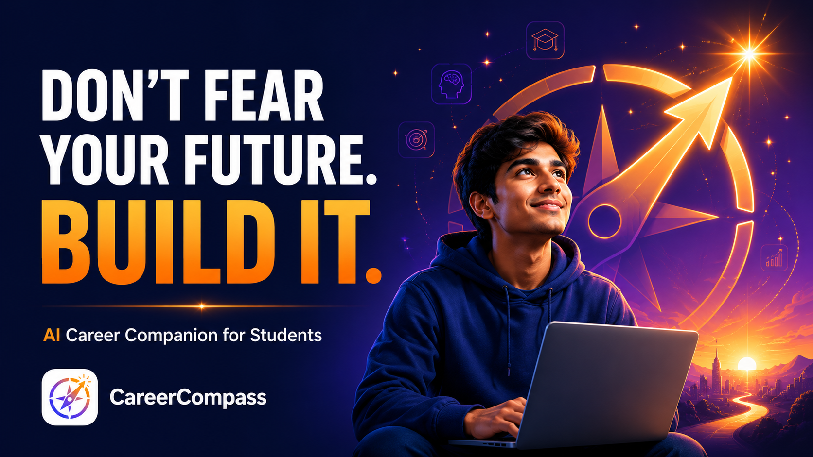

<p align="center">
  
</p>

<h1 align="center">CareerCompass</h1>

<p align="center">
  An AI-powered career and learning companion that helps students explore careers,
  learn skills, build a resume, and practise interviews with confidence.
</p>

<p align="center">
  <a href="REPLACE_WITH_LIVE_URL"><b>Live App</b></a> &nbsp;•&nbsp;
  <a href="REPLACE_WITH_YOUTUBE_URL"><b>Demo Video</b></a> &nbsp;•&nbsp;
</p>

---

## About the Project

Many students finish school full of potential but unsure of what to do next. They
struggle to find the right courses, real job information, and ways to build
confidence — especially when English feels difficult. **CareerCompass** was built to
remove that fear. It brings careers, learning, resume building, and interview
practice into one simple place, and it uses Artificial Intelligence in every step to
guide the student personally.

The idea is simple: **real data shows students what is out there, and AI helps them
understand it, plan it, and build the confidence to go after it.**

---

## Features

CareerCompass is organised into six clear sections.

| Section | What it does |
|---|---|
| **Explore Careers** | Search any career to see the skills it needs and real, live job openings. |
| **Learn** | Get a personalised study roadmap, free video courses, and the best free learning platforms — in your preferred language. |
| **Resume** | Build a clean, single-page resume with five templates, accent colours, and clickable links, then download it as a PDF. |
| **Interview & Confidence** | Practise common questions, run a mock interview, and take a full **voice interview** that asks about your own resume. |
| **Ask AI** | Chat with a friendly tutor, read and summarise PDFs or images, and turn any notes into flashcards. |
| **My Stuff** | One place that keeps your saved resume, flashcard sets, courses, and careers. |

---

## How We Used AI

AI is not a small add-on in CareerCompass — it is the heart of the product. The app
uses a **three-model fallback system** (Google Gemini as the primary model, with
Mistral and Grok as backups) so the AI keeps working even if one service is busy.
To keep it fast and affordable, every AI result is **cached** in the database, so the
same request is instant the next time.

Here is exactly where AI is used:

- **Career skills and guidance** — When official skill data is not available, AI
  estimates the key skills for a career and writes simple, practical guidance for the
  student.
- **Learning roadmaps** — AI creates a step-by-step study plan for any topic the
  student wants to learn.
- **Best learning platforms** — AI selects the most suitable free platforms for each
  topic and explains *why* each one is a good choice.
- **Resume writing help** — AI rewrites the summary and each bullet point into
  stronger, professional language with one click.
- **Interview question bank** — AI generates real interview questions for any role,
  each with two or three example ways to answer.
- **Mock interview feedback** — AI reads the student's answer and gives kind,
  specific feedback: one strength and one improvement.
- **Voice interview** — AI reads the student's uploaded resume, asks general questions
  first and then questions about their own skills and projects, and gives warm
  feedback at the end.
- **Spoken-English coaching** — AI gently corrects grammar, offers a smoother way to
  say the same thing, and encourages the student.
- **AI tutor chat** — A patient tutor explains any topic in simple English and clears
  the student's doubts step by step.
- **Document understanding** — AI summarises uploaded PDFs and images and answers
  questions using only that document.
- **Flashcard generation** — AI turns notes, PDFs, or images into question-and-answer
  flashcards for revision.

In short, **AI personalises, plans, teaches, and builds confidence**, while real data
keeps every answer grounded and honest.

---

## Tech Stack

- **Framework:** Next.js 16 (App Router) with React 19
- **Styling:** Tailwind CSS v4
- **Language:** JavaScript
- **Database:** MongoDB Atlas (via Mongoose) — used for caching AI and API results
- **Deployment:** Vercel

### APIs and Services

All services used are free to start with:

- **Google Gemini** — primary AI model (`gemini-2.5-flash`)
- **Mistral** and **Grok** — backup AI models
- **Adzuna** — live job listings
- **O\*NET** — official career and skills data
- **YouTube Data API v3** — free course videos
- **Web Speech API** — free, in-browser voice input and text-to-speech
- **unpdf** and **Tesseract.js** — reading text from PDFs and images

---

## Getting Started

### Prerequisites

- Node.js 18.18 or newer
- A MongoDB Atlas connection string
- API keys for the services listed above

### Installation

```bash
# 1. Clone the repository
git clone https://github.com/Agihtaws/CareerCompass.git
cd careercompass

# 2. Install the dependencies
npm install

# 3. Create your environment file (see the next section)
cp .env.example .env.local

# 4. Run the development server
npm run dev
```

Then open **http://localhost:3000** in your browser.

### Environment Variables

Create a file named `.env.local` in the project root and add your own keys:

```bash
# Database
MONGODB_URI=your_mongodb_connection_string

# AI models (Gemini is required; the others are optional backups)
GEMINI_API_KEY=your_gemini_key
MISTRAL_API_KEY=your_mistral_key
GROK_API_KEY=your_grok_key

# Jobs (Adzuna)
ADZUNA_APP_ID=your_adzuna_app_id
ADZUNA_APP_KEY=your_adzuna_app_key
ADZUNA_COUNTRY=in

# Courses (YouTube Data API v3)
YOUTUBE_API_KEY=your_youtube_key

# Career skills (O*NET )
ONET_API_KEY=your_onet_api_key
```

---

## Project Structure

```
src/
├─ app/
│  ├─ (app)/            # Main pages (careers, learn, resume, interview, ask, saved)
│  └─ api/              # Backend routes (AI, careers, learn, resume, interview, ask)
├─ components/          # UI components for each feature
├─ lib/                 # AI service, caching, and data helpers
└─ models/              # Mongoose database models
```

---

## License

This project is licensed under the **MIT License**. You are free to use, copy, modify,
and share it. See the [LICENSE](LICENSE) file for the full text.

---
